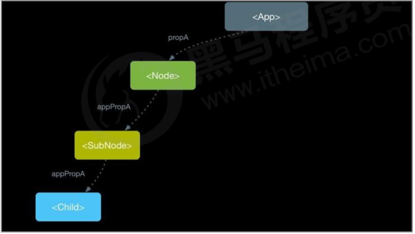
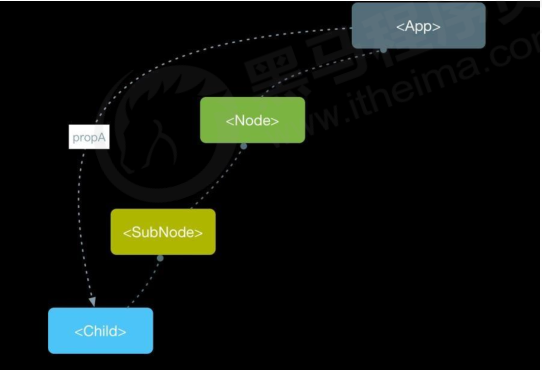

# 学习目标

+ 组件通讯介绍
+ 组件的props
+ 组件通讯的三种方式
+ Context
+ props深入

# 组件通讯

**组件**是独立且封闭的单元，默认情况下，只能使用组件自己的数据。在组件化过程中，我们将一个完整的功能
拆分成多个组件，以更好的完成整个应用的功能。而在这个过程中，多个组件之间不可避免的要共享某些数据
。为了实现这些功能，就需要打破组件的独立封闭性，让其与外界沟通。这个过程就是**组件通讯**。

## props

+ 组件是封闭的，要接收外部数据应该通过props来实现
+ **props的作用：接收传递给组件的数据**
+ 传递数据：给组件标签添加属性
+ 接收数据：函数组件通过**参数props**接收数据，类组件通过**this.props**接收数据

### 函数组件通讯

子组件

```js
function Hello(props) {
    console.log(props)
    return (
    	<div>接收到数据：{props.name}</div>
    )
}
```

父组件

```js
<Hello name="jack" age={19} />
```

### 类组件通讯

子组件

```js
class Hello extends React.Component {
    render() {
        return (
        	<div>接收到的数据：{this.props.age}</div>
        )
    }
}
```

父组件

```js
<Hello name="jack" age={19} />
```

### props的特点

+ 可以给组件传递任意类型的数据
+ props是只读的，不允许修改props的数据

+ 注意：在类组件中使用的时候，**需要把props传递给super()**，否则构造函数无法获取到props

```js
class Hello extends React.Component {
    constructor(props) {
        // 推荐将props传递给父类构造函数
        super(props)
    }
    render() {
    	return <div>接收到的数据：{this.props.age}</div>
    }
}
```

## 组件通讯三种方式

+ 父传子
+ 子传父
+ 兄弟组件

### 父传子

1. 父组件提供要传递的state数据
2. 给子组件标签添加属性，值为 state 中的数据
3. 子组件中通过 props 接收父组件中传递的数据

父组件提供数据并且传递给子组件

```js
class Parent extends React.Component {
    state = { lastName: '王' }
    render() {
        return (
            <div>
                传递数据给子组件：<Child name={this.state.lastName} />
            </div>
        )
    }
}
```

子组件接收数据

```js
function Child(props) {
	return <div>子组件接收到数据：{props.name}</div>
}
```

### 子传父

思路：利用回调函数，父组件提供回调函数，子组件调用，将要传递的数据作为回调函数的参数。
1. 父组件提供一个回调函数（用于接收数据）
2. 将该函数作为属性的值，传递给子组件
3. 子组件通过 props 调用回调函数
4. 将子组件的数据作为参数传递给回调函数


父组件提供函数并且传递给字符串

```js
class Parent extends React.Component {
    getChildMsg = (msg) => {
        console.log('接收到子组件数据', msg)
    }
    render() {
        return (
            <div>
            	子组件：<Child getMsg={this.getChildMsg} />
            </div>
        )
    }
}
```


子组件接收函数并且调用

```js
class Child extends React.Component {
    state = { childMsg: 'React' }
    handleClick = () => {
    	this.props.getMsg(this.state.childMsg)
    }
    return (
    	<button onClick={this.handleClick}>点我，给父组件传递数据</button>
    )
}
```

**注意：回调函数中 this 指向问题！**

### 兄弟组件

+ 将共享状态提升到最近的公共父组件中，由公共父组件管理这个状态
+ 思想：**状态提升**
+ 公共父组件职责：
  + 提供共享状态 
  + 提供操作共享状态的方法
+ 要通讯的子组件只需通过 props 接收状态或操作状态的方法


状态提升前


状态提升之后


### 评论列表案例

+ 组件拆分
  + CommentForm组件
  + CommentList组件
  + Comment父组件
+ 评论列表功能实现（父传子）
+ 发表评论功能实现（子传父）
+ 清空评论功能实现（子传父）
+ 删除评论功能实现（子传父）

## 组件通讯-context

### 基本概念

思考：App 组件要传递数据给 Child 组件，该如何处理？



处理方式：使用 props 一层层组件往下传递（繁琐）

更好的：使用 Context

 作用：跨组件传递数据（比如：主题、语言等）



### 实现思路

+ 调用 React. createContext() 创建 Provider（提供数据） 和 Consumer（消费数据） 两个组件。

```js
const { Provider, Consumer } = React.createContext()
```

+ 使用 Provider 组件作为父节点。

```js
<Provider>
    <div className="App">
    	<Child1 />
    </div>
</Provider>
```

+ 设置 value 属性，表示要传递的数据。

```js
<Provider value="pink">
```

+ 调用 Consumer 组件接收数据。

```js
<Consumer>
	{data => <span>data参数表示接收到的数据 -- {data}</span>}
</Consumer>
```

总结：

1. 如果两个组件是远方亲戚（比如，嵌套多层）可以使用Context实现组件通讯
2. Context提供了两个组件：Provider 和 Consumer
3. Provider组件：用来提供数据
4. Consumer组件：用来消费数据

# props深入

## children属性

children属性：表示该组件的子节点，只要组件有子节点，props就有该属性

children 属性与普通的props一样，值可以是任意值（文本、React元素、组件，甚至是函数）

```js
function Hello(props) {
  return (
    <div>
      该组件的子节点：{props.children}
    </div>
  )
}

<Hello>我是子节点</Hello>

```

## props校验

目的：校验接收的props的数据类型，增加组件的健壮性

对于组件来说，props是外来的，无法保证组件使用者传入什么格式的数据

如果传入的数据格式不对，可能会导致组件内部报错。**组件的使用者不能很明确的知道错误的原因。**


props校验允许在创建组件的时候，就约定props的格式、类型等


作用：规定接收的props的类型必须为数组，如果不是数组就会报错，增加组件的健壮性。


### 使用步骤

1. 安装包 prop-types （yarn add prop-types / npm i props-types）

2. 导入 prop-types 包
3. 使用组件名.propTypes = {} 来给组件的props添加校验规则
4. 校验规则通过 PropTypes 对象来指定

```js
import PropTypes from 'prop-types'
function App(props) {
    return (
    	<h1>Hi, {props.colors}</h1>
    )
}
App.propTypes = {
    // 约定colors属性为array类型
    // 如果类型不对，则报出明确错误，便于分析错误原因
    colors: PropTypes.array
}
```


### 约束规则

1. 常见类型：array、bool、func、number、object、string
2. React元素类型：element
3. 必填项：isRequired
4. 特定结构的对象：shape({ })

```js
// 常见类型
optionalFunc: PropTypes.func,
// 必选
requiredFunc: PropTypes.func.isRequired,
// 特定结构的对象
optionalObjectWithShape: PropTypes.shape({
	color: PropTypes.string,
	fontSize: PropTypes.number
})
```


## props默认值

场景：分页组件 ：每页显示条数
作用：给 props 设置默认值，在未传入 props 时生效

```js
function App(props) {
    return (
        <div>
            此处展示props的默认值：{props.pageSize}
        </div>
    )
}
// 设置默认值
App.defaultProps = {
	pageSize: 10
}
// 不传入pageSize属性
<App />
```


## 类的静态属性static

+ 在类中，使用static关键字可以给类增加一个静态的属性或者方法

